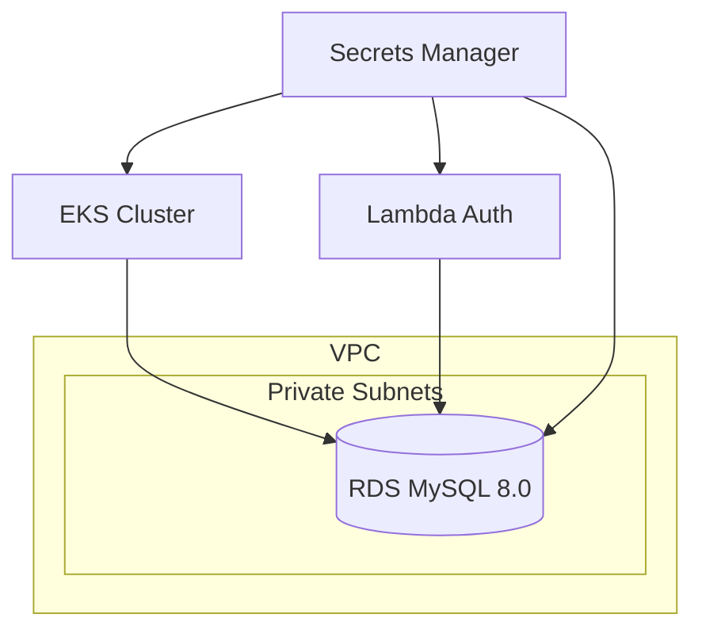

# MotorTech Infra DB — Terraform RDS + Secrets Manager

> Infraestrutura do Banco de Dados Gerenciado (AWS RDS MySQL) e Secrets Manager para o sistema MotorTech.

## Arquitetura



## Tecnologias

- **Terraform** >= 1.5
- **AWS RDS** MySQL 8.0
- **AWS Secrets Manager**

## Módulos

| Módulo | Descrição |
|--------|-----------|
| `rds` | RDS MySQL, subnet group, security group, parameter group |
| `secrets-manager` | DB credentials, JWT secret, APP_KEY, webhook token |

## Ambientes

| Ambiente | Instance Class | Multi-AZ | Backup |
|----------|---------------|----------|--------|
| Homologation | db.t3.micro | Não | 7 dias |
| Production | db.t3.small | Sim | 14 dias |

## Pré-requisitos

1. AWS CLI configurado
2. Terraform >= 1.5
3. VPC já criada (via `motortech-infra-k8s`)
4. S3 bucket `motortech-tf-state` + DynamoDB `motortech-tf-lock`

## Secrets necessários no GitHub Actions

| Secret | Descrição |
|--------|-----------|
| `AWS_ROLE_ARN` | ARN do IAM Role para OIDC |
| `DB_PASSWORD` | Senha do banco de dados |
| `JWT_SECRET` | Chave JWT compartilhada |
| `APP_KEY` | Laravel APP_KEY |
| `WEBHOOK_TOKEN` | Token de autenticação de webhooks |

## Como Usar

```bash
cd environments/homologation
terraform init
terraform plan -var="db_password=xxx" -var="jwt_secret=xxx" -var="app_key=xxx" -var="webhook_token=xxx"
terraform apply
```

## CI/CD (GitHub Actions)

| Workflow | Trigger | Ação |
|----------|---------|------|
| `plan.yml` | PR para main | Terraform plan (ambos ambientes) |
| `apply-hml.yml` | Push em homologation | Terraform apply (HML) |
| `apply-prod.yml` | Push em production | Terraform apply (PROD) |
